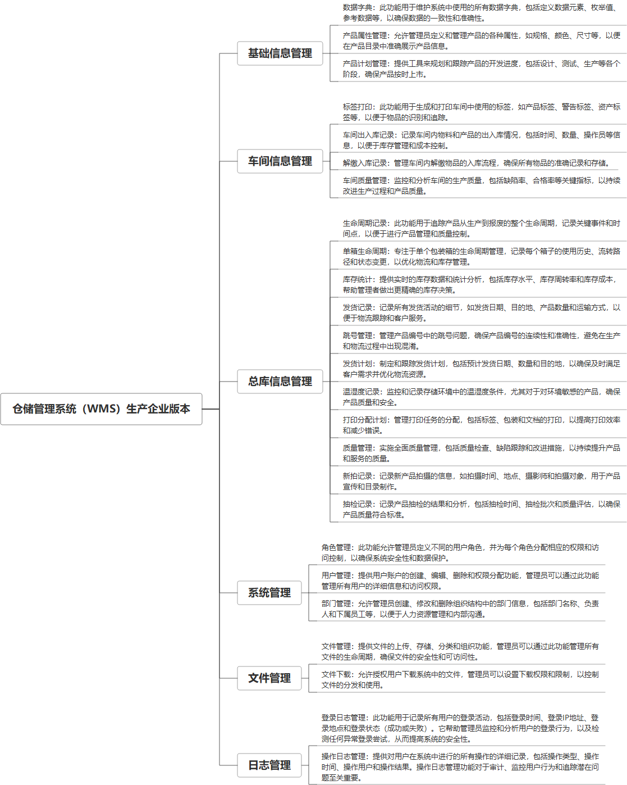

 

    
 

公司拥有上百套具有自主知识产权的软件系统，详情请查看码云首页或公司官网

 
<h1>仓储管理系统（WMS）-贵金属</h1>

<a href="https://www.haishi.net.cn/">公司官网</a> ｜ <a href="https://www.haishi.net.cn/">在线体验</a>

 

## 系统介绍

工厂-仓储管理系统-生产类企业，包含产品属性管理、车间信息管理、标签打印、车间出入库、记录解缴入库记录、总库信息管理、生命周期记录、单箱生命周期、库存统计、发货记录、温湿度记录、质量管理、新拍记录抽检记录登记管理、临时库登记页面总库1登记页面总库、文件管理、文件管理、文件下载、车间质量管理、跳号管理、发货计划、打印分配计划、产品计划管理
本项目名称为仓储管理系统-生产企业版，是面向生产企业的仓库管理系统，涵盖了从生产、存储到发货的完整流程。该系统适用于拥有自营仓库的生产型企业，旨在通过信息化手段提高仓库管理效率，降低库存成本，提升产品质量。
本系统主要功能模块包括：基本信息管理、车间信息管理、总库信息管理、系统管理、日志管理以及文件管理。
- 基本信息管理：提供数据字典维护、产品属性定义以及产品计划制定等功能，为仓库管理提供基础数据支撑。
- 车间信息管理：涵盖了车间标签打印、出入库记录、解缴入库记录以及车间质量管理等功能，实现对车间生产环节的精细化管理。
- 总库信息管理：包含了产品生命周期记录、单箱生命周期追踪、库存统计、发货记录、跳号管理、发货计划制定、温湿度记录、打印分配计划、质量管理、新拍记录以及抽检记录等功能，对仓库的整体运营进行全方位管理。
- 系统管理：提供角色管理、用户管理以及部门管理等功能，实现对系统用户的权限控制和组织架构管理。
- 日志管理：记录登录日志和操作日志，为系统安全审计和问题追溯提供依据。
- 文件管理：提供文件上传、下载以及管理等功能，方便用户进行相关文件存储和共享。
                

## 系统功能介绍

### 系统包含终端说明

管理端（WEB）

| 序号 | 模块               | 模块说明 |
| ---- | ------------------ | -------- |
| 1    | GC-WMS-SCQY-SERVER | 服务端   |
| 2    | GC-WMS-SCQY-MANAGE | 管理端   |

### 系统功能结构

### 系统功能说明

主要功能：
- 数据字典管理
- 产品属性管理
- 产品计划管理
- 标签打印
- 车间出入库记录
- 解缴入库记录
- 车间质量管理
- 生命周期记录
- 单箱生命周期追踪
- 库存统计
- 发货记录
- 跳号管理
- 发货计划
- 温湿度记录
- 打印分配计划
- 质量管理
- 新拍记录
- 抽检记录
- 角色管理
- 用户管理
- 部门管理
- 登录日志管理
- 操作日志管理
- 文件管理
- 文件下载

## 系统主要界面

## 系统技术说明

### 代码模块说明

| 序号 | 目录                   | 目录说明 |
| ---- | ---------------------- | -------- |
| 1    | GC-WMS-SCQY-SERVER/lib | --       |
| 2    | GC-WMS-SCQY-SERVER/src | --       |

### 系统技术选型

#### 开发语言/框架

JAVA（JDK1.8）
前端框架：VUE2
系统结构：单体应用
框架：SpringBoot2.x

#### 服务中间件

Nginx
Tomcat

#### 数据库

MySQL（5.7+）
Redis

#### 其他说明

无

## 系统演示/商用

请扫码添加客服微信获取演示地址和系统详细资料。

如果您想基于仓储管理系统（WMS）-贵金属进行商业化交付或定制开发服务，我们提供有偿的技术服务支持，合作模式不限，欢迎沟通！

公司官网地址： <a href="https://www.haishi.net.cn/">https://www.haishi.net.cn</a>

联系客服获取专业回答。

## 使用须知

1、 本项目商用必须获得版权所有者的授权。

2、 未经允许本项目代码不允许二次出售。

